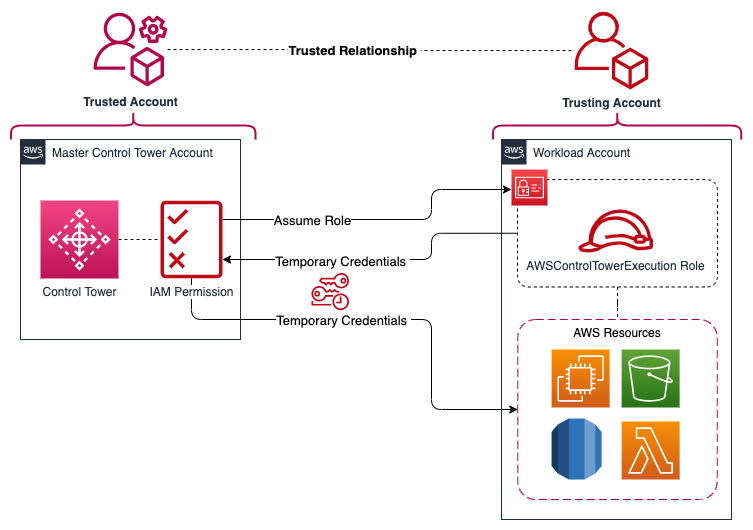

# CloudFormation template to deploy a Control Tower Cross-Account Role

This CloudFormation template creates an IAM role with administrator access and builds a trust relationship with the control tower management/master account. This role can be used to perform a switch role action or to enroll the account in the control tower organization.

> :warning: To use this template, replace the account ID number on line 33 in the .json file. :warning:	

## Deployment diagram:



## Role details: 
- Role Name: AWSControlTowerExecution
- Role Permission: AdministratorAccess (AWS managed policy)
- Role Trust Relationship: Management Account ID

## Full Access Policy:

```json
{
    "Version": "2012-10-17",
    "Statement": [
        {
            "Action":"*",
            "Resource":"*",
            "Effect":"Allow",
            "Sid":"ControlTowerCrossAccountRole"
        }
    ]
}
```

## Trust Relationship:

```json
{
    "Version": "2012-10-17",
    "Statement": [
        {
            "Action":"sts:AssumeRole",
            "Effect":"Allow",
            "Principal":{
                "AWS":"arn:aws:iam::XXXXXXXXXX:root"
                }
        }
    ]
}
```

## Documentation:

- [Creating a stack on the AWS CloudFormation console](https://docs.aws.amazon.com/AWSCloudFormation/latest/UserGuide/cfn-console-create-stack.html)
